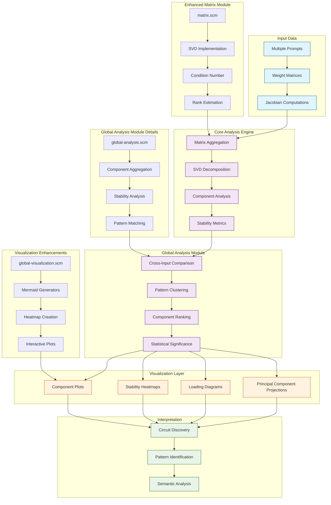
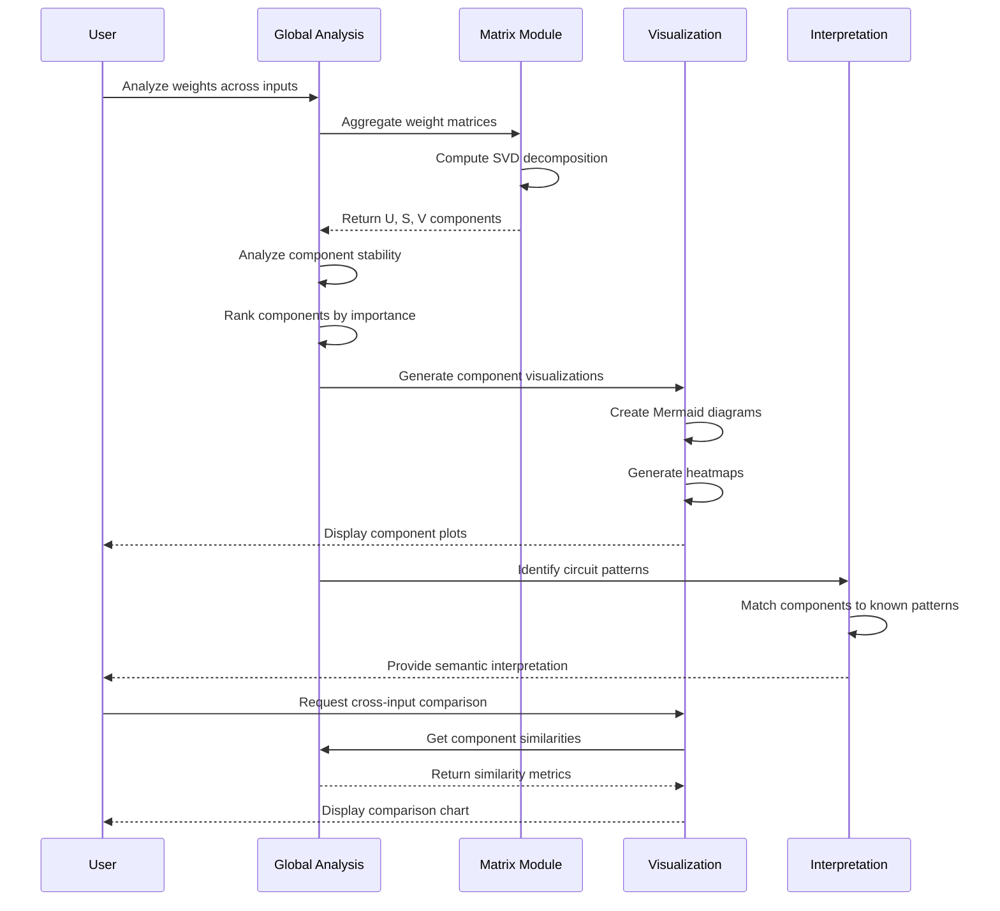
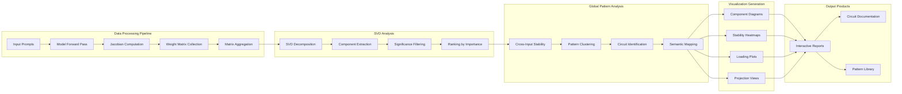
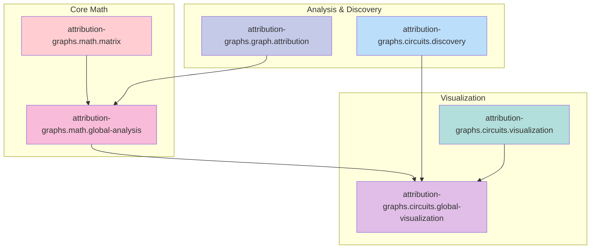

# Global Analysis Architecture Diagram

```mermaid
graph TB
    subgraph "Input Data"
        A[Multiple Prompts] --> B[Weight Matrices]
        B --> C[Jacobian Computations]
    end
    
    subgraph "Core Analysis Engine"
        C --> D[Matrix Aggregation]
        D --> E[SVD Decomposition]
        E --> F[Component Analysis]
        F --> G[Stability Metrics]
    end
    
    subgraph "Global Analysis Module"
        G --> H[Cross-Input Comparison]
        H --> I[Pattern Clustering]
        I --> J[Component Ranking]
        J --> K[Statistical Significance]
    end
    
    subgraph "Visualization Layer"
        K --> L[Component Plots]
        K --> M[Stability Heatmaps]
        K --> N[Loading Diagrams]
        K --> O[Principal Component Projections]
    end
    
    subgraph "Interpretation"
        L --> P[Circuit Discovery]
        M --> P
        N --> P
        O --> P
        P --> Q[Pattern Identification]
        Q --> R[Semantic Analysis]
    end
    
    subgraph "Enhanced Matrix Module"
        S[matrix.scm] --> T[SVD Implementation]
        T --> U[Condition Number]
        U --> V[Rank Estimation]
        V --> D
    end
    
    subgraph "Global Analysis Module Details"
        W[global-analysis.scm] --> X[Component Aggregation]
        X --> Y[Stability Analysis]
        Y --> Z[Pattern Matching]
        Z --> H
    end
    
    subgraph "Visualization Enhancements"
        AA[global-visualization.scm] --> BB[Mermaid Generators]
        BB --> CC[Heatmap Creation]
        CC --> DD[Interactive Plots]
        DD --> L
    end
    
    style A fill:#e1f5fe
    style E fill:#f3e5f5
    style P fill:#e8f5e8
    style L fill:#fff3e0
    
    classDef inputClass fill:#e1f5fe,stroke:#01579b
    classDef analysisClass fill:#f3e5f5,stroke:#4a148c
    classDef interpretClass fill:#e8f5e8,stroke:#1b5e20
    classDef vizClass fill:#fff3e0,stroke:#e65100
    
    class A,B,C inputClass
    class D,E,F,G,H,I,J,K analysisClass
    class P,Q,R interpretClass
    class L,M,N,O vizClass
```

## Component Interaction Flow

```mermaid
sequenceDiagram
    participant User
    participant GlobalAnalysis as Global Analysis
    participant Matrix as Matrix Module
    participant Viz as Visualization
    participant Interp as Interpretation
    
    User->>GlobalAnalysis: Analyze weights across inputs
    GlobalAnalysis->>Matrix: Aggregate weight matrices
    Matrix->>Matrix: Compute SVD decomposition
    Matrix-->>GlobalAnalysis: Return U, S, V components
    
    GlobalAnalysis->>GlobalAnalysis: Analyze component stability
    GlobalAnalysis->>GlobalAnalysis: Rank components by importance
    
    GlobalAnalysis->>Viz: Generate component visualizations
    Viz->>Viz: Create Mermaid diagrams
    Viz->>Viz: Generate heatmaps
    Viz-->>User: Display component plots
    
    GlobalAnalysis->>Interp: Identify circuit patterns
    Interp->>Interp: Match components to known patterns
    Interp-->>User: Provide semantic interpretation
    
    User->>Viz: Request cross-input comparison
    Viz->>GlobalAnalysis: Get component similarities
    GlobalAnalysis-->>Viz: Return similarity metrics
    Viz-->>User: Display comparison chart
```

## Data Flow Architecture

```mermaid
flowchart LR
    subgraph "Data Processing Pipeline"
        A[Input Prompts] --> B[Model Forward Pass]
        B --> C[Jacobian Computation]
        C --> D[Weight Matrix Collection]
        D --> E[Matrix Aggregation]
    end
    
    subgraph "SVD Analysis"
        E --> F[SVD Decomposition]
        F --> G[Component Extraction]
        G --> H[Significance Filtering]
        H --> I[Ranking by Importance]
    end
    
    subgraph "Global Pattern Analysis"
        I --> J[Cross-Input Stability]
        J --> K[Pattern Clustering]
        K --> L[Circuit Identification]
        L --> M[Semantic Mapping]
    end
    
    subgraph "Visualization Generation"
        M --> N[Component Diagrams]
        M --> O[Stability Heatmaps]
        M --> P[Loading Plots]
        M --> Q[Projection Views]
    end
    
    subgraph "Output Products"
        N --> R[Interactive Reports]
        O --> R
        P --> R
        Q --> R
        R --> S[Circuit Documentation]
        R --> T[Pattern Library]
    end
```

## Module Dependencies

```mermaid
graph TD
    A[attribution-graphs.math.matrix] --> B[attribution-graphs.math.global-analysis]
    B --> C[attribution-graphs.circuits.global-visualization]
    D[attribution-graphs.graph.attribution] --> B
    E[attribution-graphs.circuits.discovery] --> C
    F[attribution-graphs.circuits.visualization] --> C
    
    subgraph "Core Math"
        A
        B
    end
    
    subgraph "Analysis & Discovery"
        D
        E
    end
    
    subgraph "Visualization"
        F
        C
    end
    
    style A fill:#ffcdd2
    style B fill:#f8bbd9
    style C fill:#e1bee7
    style D fill:#c5cae9
    style E fill:#bbdefb
    style F fill:#b2dfdb
```